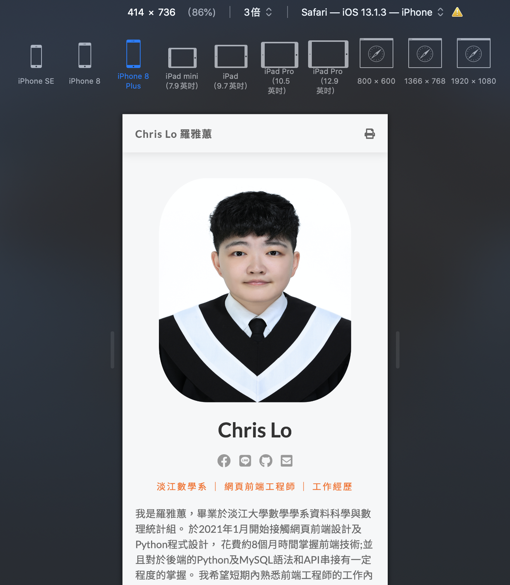
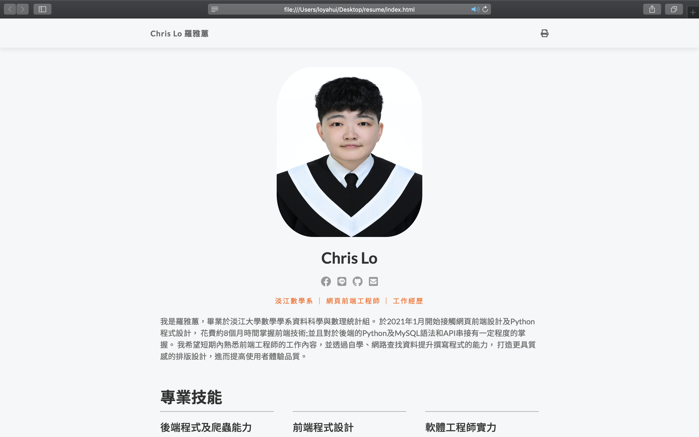

# Resume

使用HTML5及CSS，並搭配RWD響應式網站設計所打造的網站。

## 網站主要功能

- 使用者可在履歷表內看到自我介紹、專業技能及工作經歷。
- 使用者可點擊右上角欄位，將畫面移至指定區域。
- 使用者可點擊社群圖示，查看各個社群連結。
- 使用者可點擊信件圖示，以發送郵件至指定信箱。
- 網頁排版會根據使用者的螢幕大小而有不同呈現方式。

## 專案畫面截圖
- 手機版畫面呈現
 

- 電腦版畫面呈現
 

## 開發環境

- Spyder
- HTML5
- CSS
- Font Awesome

## 專案開發人員

> [Chris Lo](https://github.com/Chrislo-coding)
